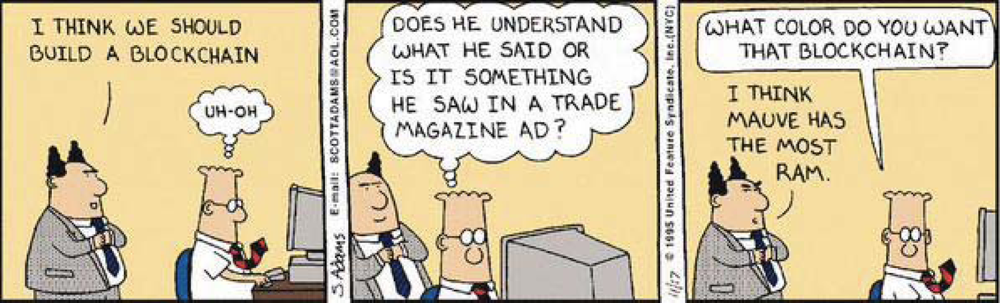
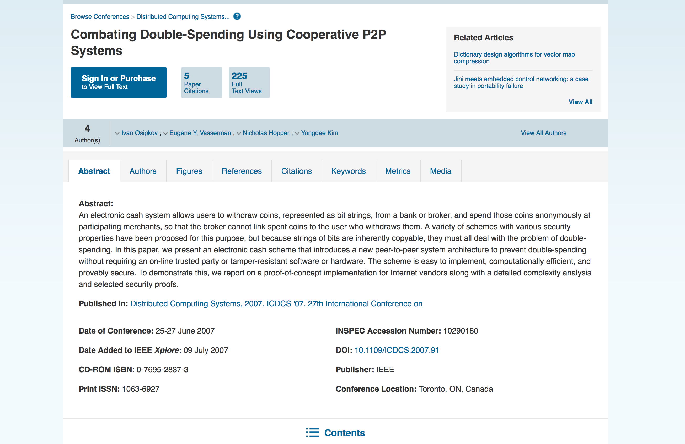
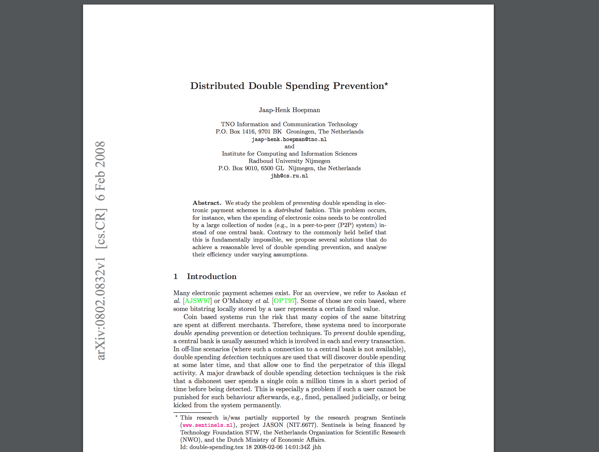
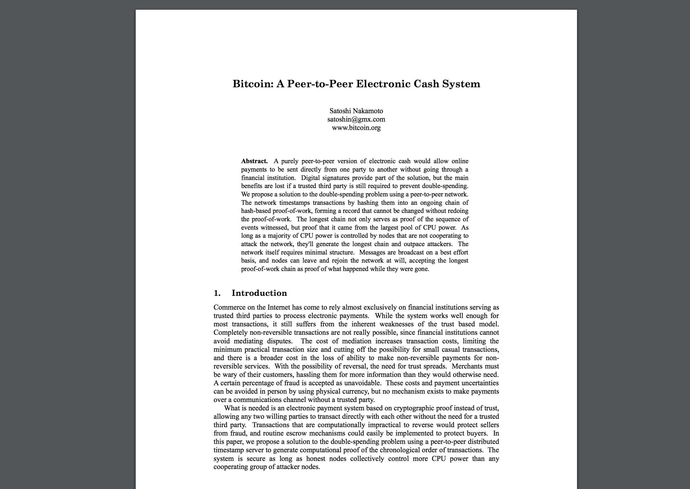
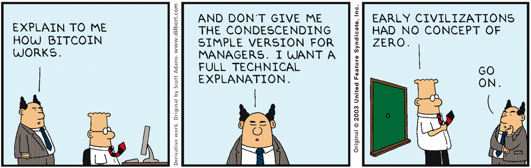
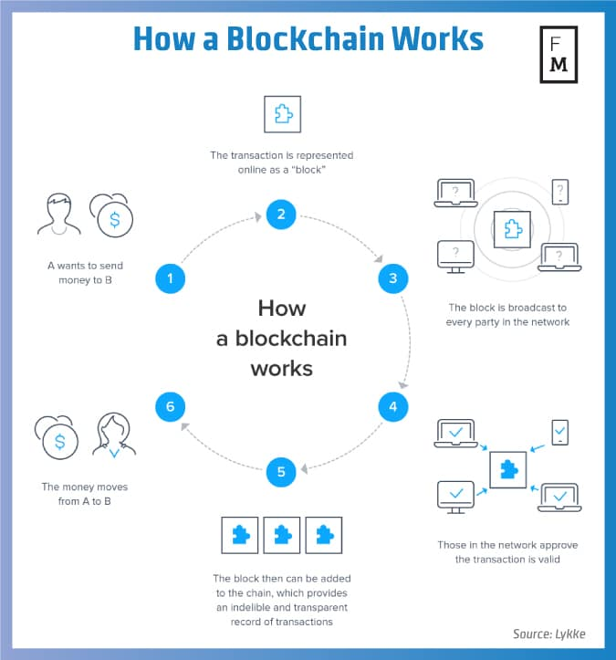

<!--
$theme: gaia
page_number: true
*template: invert
-->

###### 

Introduction to Blockchain
==========================

#### Diogo Trentini | Lauro Gripa

###### www.magrathealabs.com

---

## Summary

1. Introduction:
   a. The "Double-spending" problem;
   b. Why is it interesting?
2. Theoretical concepts:
   a. What's a blockchain?
   b. It's just a database
   c. Vulnerabilities
3. Applications / Examples
4. Conclusions

---

<!-- *footer: source: Scott Adams' Dilbert -->

---

 
 
 

## The =="Double-spending"== problem

> ### ==Double-spending== is the result of successfully spending some money more than once.

---

<!-- A number of distributed systems had been proposed since 2007 -->

<!-- *footer: source: http://ieeexplore.ieee.org/document/4268195/ -->

---

<!-- *template: invert -->

---

<!-- Bitcoin, using a proof-of-work system (Hashcash) on a distributed ledger of transactions, was proposed in 2009 -->

<!-- *footer: source: https://bitcoin.org/bitcoin.pdf -->

---

## Why is it interesting?

<!-- Other electronic systems prevent double-spending by having a master authoritative source that follows business rules for authorizing each transaction. Bitcoin uses a decentralized system, where a consensus among nodes following the same protocol and proof of work is substituted for a central authority. Possession of bitcoin is not enforced by business rules and policy, but cryptography and game theory. -->

<!-- Because bitcoin transactions can be final, merchants do not need to hassle customers for extra information like billing address, name, etc, so bitcoin can be used without registering a real name or excluding users based on age, nationality or residency. -->

---

<!-- *footer: source: Scott Adams' Dilbert -->

---

---

<!-- *template: invert -->

# [DEMO]

---

<!-- Concepts: immutable database + PKI (hashes) + P2P protocols + Consensus algorithms like Paxos / Raft / PoW (https://www.wikiwand.com/en/Hashcash): -->

<!-- The two differentiators of DLT in my opinion: (a) the control of the read/write access is truly decentralized and not logically centralized as for other distributed databases, and corollary (b) the ability to secure transactions in competing environments, without trusted third parties. -->

---

# Bitcoin components

- Address (public key) + Wallet (private keys)
- Transactions
- Blocks
- Ledger
- Consensus Network + Consensus Algorithm

<!-- 
Block:
- The number of Bitcoins generated per block starts at 50 and is halved every 210,000 blocks (about four years).
- Mining
- Block buffer: bitcoin transactions are broadcast to the network by the sender, and all peers trying to solve blocks collect the transaction records and add them to the block they are working to solve. Miners get incentive to include transactions in their blocks because of attached transaction fees.

Ledger:
- The client accepts the 'longest' chain of blocks as valid. The 'length' of the entire block chain refers to the chain with the most combined difficulty, not the one with the most blocks.

Consensus Network + Consensus Algorithm:
- PoW (Hashcash) + PoS
-->

---

<!-- *footer: source: https://monax.io/explainers/blockchains/ -->

---

<!-- *template: invert -->

## It's just a database;

- A very specific one: **distributed ledger**;
- CAP Theorem:
  - ACID;
  - BASE.

---

<!-- *template: invert -->

# PoW vs PoS vs PoA vs PoB?

---

<!-- *footer: source: https://blockgeeks.com/guides/proof-of-work-vs-proof-of-stake/ -->

---

<!-- *template: invert -->

## Challenges

- Adoption
- Scalability
- Energy Consumption (PoW related)
- Vulnerabilities:
  - Bugs
  - 51% attack
  - Sybil attack

<!--
Scalability

- For example, in the transactions space, the VISA network averages 2,000 transactions per second (tps) and at peak times that figure goes up to approximately 50,000 tps. By contrast, the largest public blockchain out there, bitcoin, averages 7 tps.

Sybil attack:
- An attacker can attempt to fill the network with clients controlled by him, you would then be very likely to connect only to attacker nodes.
-->

---

<!-- *footer: source: https://medium.com/@micheledaliessi/how-does-the-blockchain-work-98c8cd01d2ae -->

---

<!-- *footer: source: xkcd.com -->

<!-- Humans are still the highest vulnerability. -->

---

<!-- *template: invert -->

## Bugs

---

# Applications

---

<!-- *template: invert -->

<!-- *footer: source: numer.ai -->

---

## Decentralized, but trust is still needed

> While one of the most important features of blockchains is removing the need for trusted third parties, **most people don't have the time or background to thoroughly evaluate the software**, which means that trust is still needed: trust in the developers of the project, or someone else capable of evaluating the software.

<!-- *footer: source: https://medium.com/@neha/9a6a9ddc4367 -->

---

## Not a jack-of-all-trades:

> Blockchain is not a general-purpose solution for everything. It should be considered as an enabler to creating new decentralized services and solving specific business problems (such as the double-spend problem in trustless P2P environments for the brilliant Bitcoin).

<!-- *footer: source: https://medium.com/@sbmeunier/e63d00781118 -->
