<!-- .slide: data-background-image="images/mlabs/background.jpg" data-background-size="cover"; style="height: 100%" -->

  <h3 style="color: white">**Carreiras** em Computação</h3>

  
  
www.magrathealabs.com

Note: LISP é vida Loka e quem usa R tem problemas.

---

## **MLABS**

* Laboratório de Engenharia de Software
* ~ 9 meses: 12 engenheiros, designers e cara do negócio
* Braço de inovação
* Identificar dores no mercado

**Palavras-chave:**

Design de Produtos de Software, Engenharia de Software, Sistemas Distribuídos, Inteligência Artificial, Ciência de Dados.

---

## `/purpose`

> “[...] the future is already here, it’s just not very evenly distributed” ― William Gibson

`Transformar o futuro em presente`

[playbook.magrathealabs.com](http://playbook.magrathealabs.com)

---

### Alan R. **Fachini**

<!-- .element: style="width: 50%" -->

Note: Comentar que entrou como último aluno no vestibular, na terceira chamada. O que foi o MuSA?

---

## **Carreiras**

Um resumo de caminhos para seguir e tecnologias para adotar na área de desenvolvimento de software.

Baseado no [Web Developer Roadmap 2017](https://github.com/kamranahmedse/developer-roadmap)

Note: É a minha visão, do que eu acho melhor. Vocês podem encontrar outros caminhos.

---

<!-- .slide: data-background-color="#fff" -->

  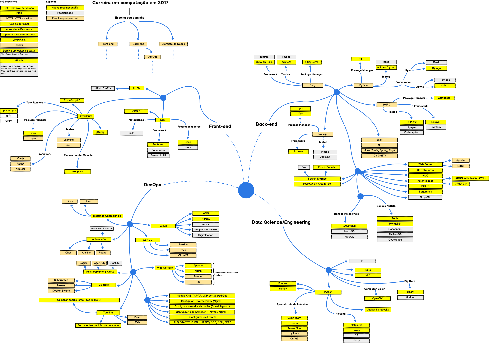

---

<!-- .slide: data-background-color="#fff" -->

## **Bootstrap**

  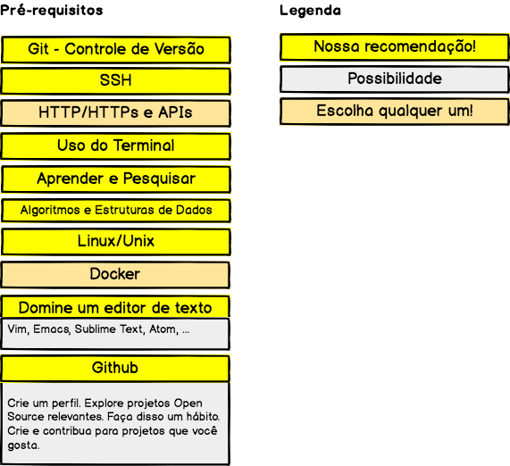

---

<!-- .slide: data-background-color="#fff" -->

  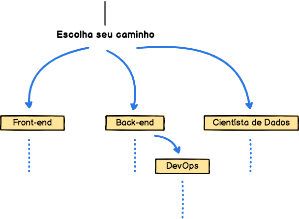

---

<!-- .slide: data-background-color="#fff" -->

## **Back-end**

  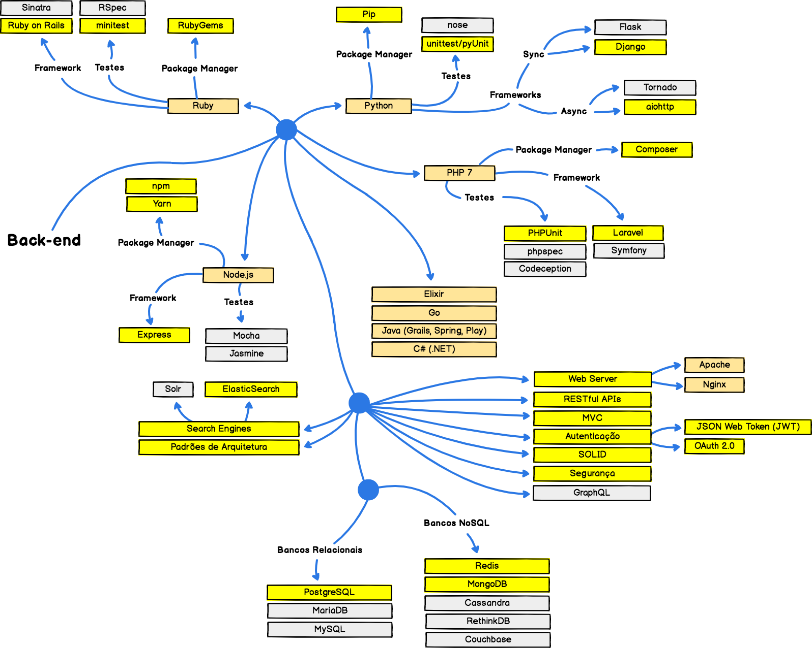
  <!-- .element: style="width: 70%" -->

---

<!-- .slide: data-background-color="#fff" -->

## **Front-end**

  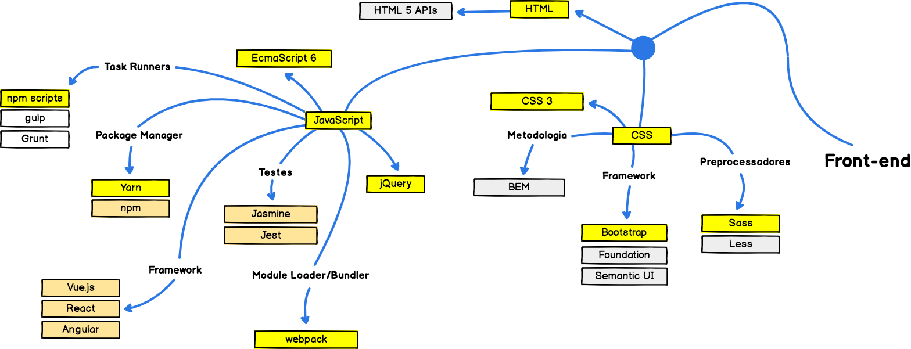

---

<!-- .slide: data-background-color="#fff" -->

## **Data Science**

  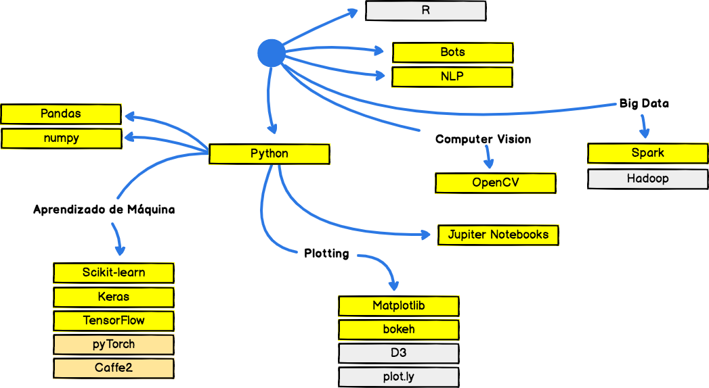

---

<!-- .slide: data-background-color="#fff" -->

## **DevOps**

  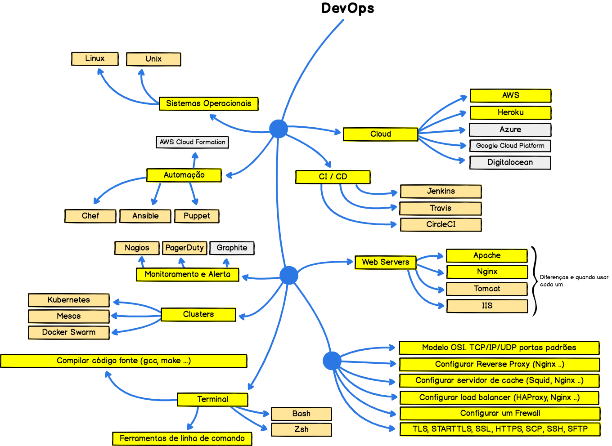
  <!-- .element: style="width: 70%" -->

---

Qual é a maior diferença do curso de computação da **UDESC** e de **Stanford**?

Note: Usamos o mesmo currículo, os mesmos livros. Temos acessos aos mesmos recursos.
A mágica acontece fora da sala de aula.

---

  

---

  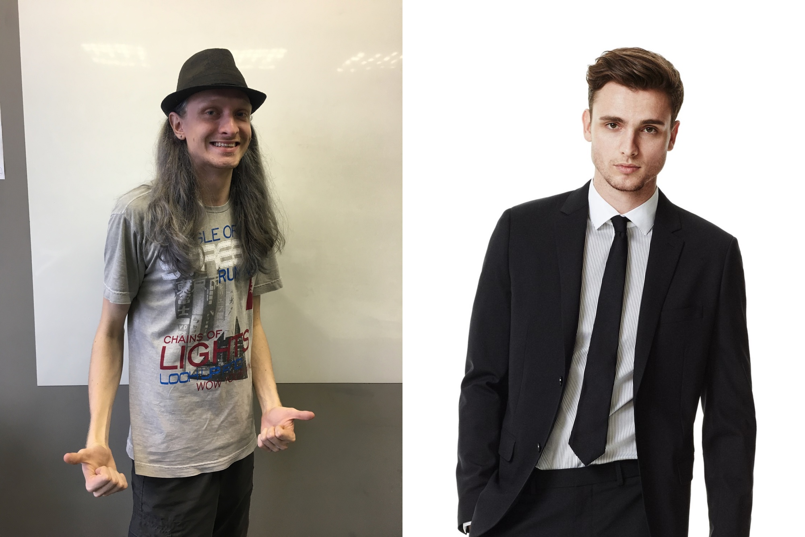
  <!-- .element: style="width: 100%" -->

---

A **mágica** acontece fora da sala de aula.

Note: Se você ficar somente dentro da sala, terá o mesmo conhecimento que todos os demais.
Fora dela é onde você pode se desenvolver de outras formas.

---

## **Dicas**

* Leia muito, de tudo um pouco
* Crie objetivos semestrais e anuais
* Feito é melhor do que perfeito
* Guarde dinheiro

Note: Seus objetivos podem mudar no caminho, mas tenha objetivos
Feito é melhor que perfeito: arrisque, erre, aprenda

---

#### Seja **empreendedor** da sua carreira

> “Work on yourself, not on your job”

Note: O que você quer aqui nesse curso? Quais são seus objetivos? Só entrar em sala de aula?

---

Arrisque, teste, erre, **aprenda**, repita.

Note: A graduação é um daqueles momentos ideias para arriscar, testar coisas, errar e aprender.
Com frequência e de forma consistente se coloque em situações onde outras pessoas apenas
poderiam sonhar em estar. Os resultados que você obtem não são fruto do seu talento. Muitas
pessoas tem talento. Apenas algumas são requeridas para para assumir desafios. A maior parte
das pessoas nunca se colocou em situações que demandam, que assustam. Você precisa se colocar
em posições que criam pressão. O tipo de pressão que tem potencial de te fortalecer ou de te quebrar.

---

## Desenvolva

1. Resiliência
2. Autonomia
3. Conciência
4. Consistência

Note: Resiliência é conseguir se recuperar de fracassos, é tentar de novo de um jeito diferente até conseguir.
Consistência é fazer todo dia, é criar rotina

---

Seja **humilde**.

Note: Infelizmente eu demorei para aprender, e talvez não tenha aprendido ainda.
Logo no meu primeiro emprego eu me achava desvalorizado e que eu deveria ter outras posições.
Seja humilde, aprenda com os que vieram antes de você.

---

Seja **lembrado** pelos seus professores.

Note: Be so good they can't ignore you.

---

## **Comunidade**

Nunca desperdice momentos de conexão. 
Participe e ajude a organizar comunidades de profissionais.

Note: Dessa forma você começa a conhecer e aprender com pessoas que já estão no mercado.
Você ganha anos de experiência enquanto ainda estiver na graduação, que é um momento
onde você pode testar e errar sem muita preocupação.

---

  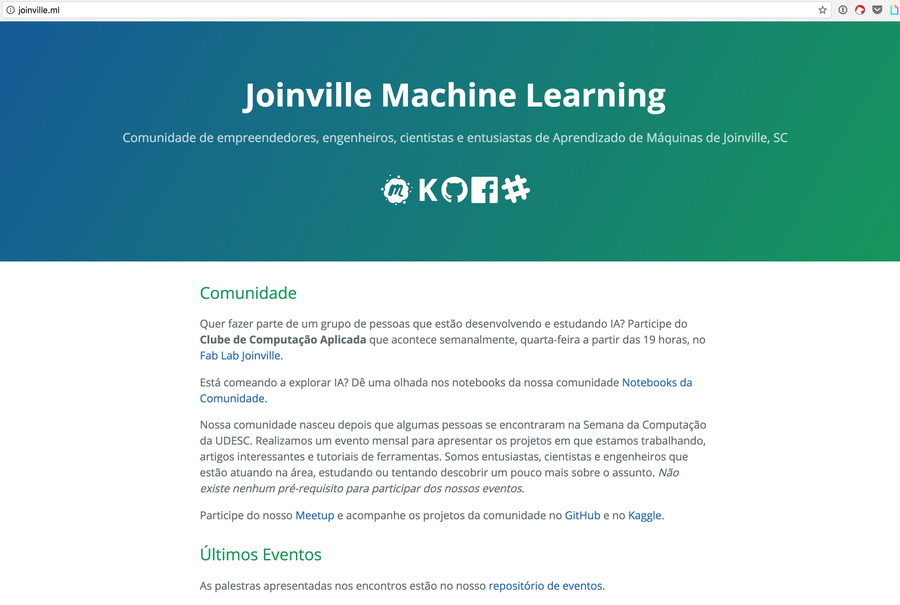
  <!-- .element: style="width: 80%" -->
   
  [joinville.ml](http://joinville.ml)

---

  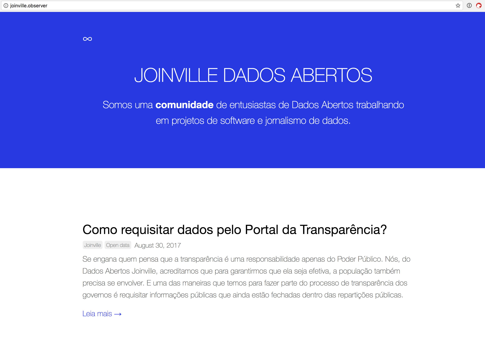
  <!-- .element: style="width: 80%" -->
   
  [joinville.observer](http://joinville.observer)

---

  
  <!-- .element: style="width: 60%" -->
   
  [fablabjoinville.com.br](http://www.fablabjoinville.com.br)

---

  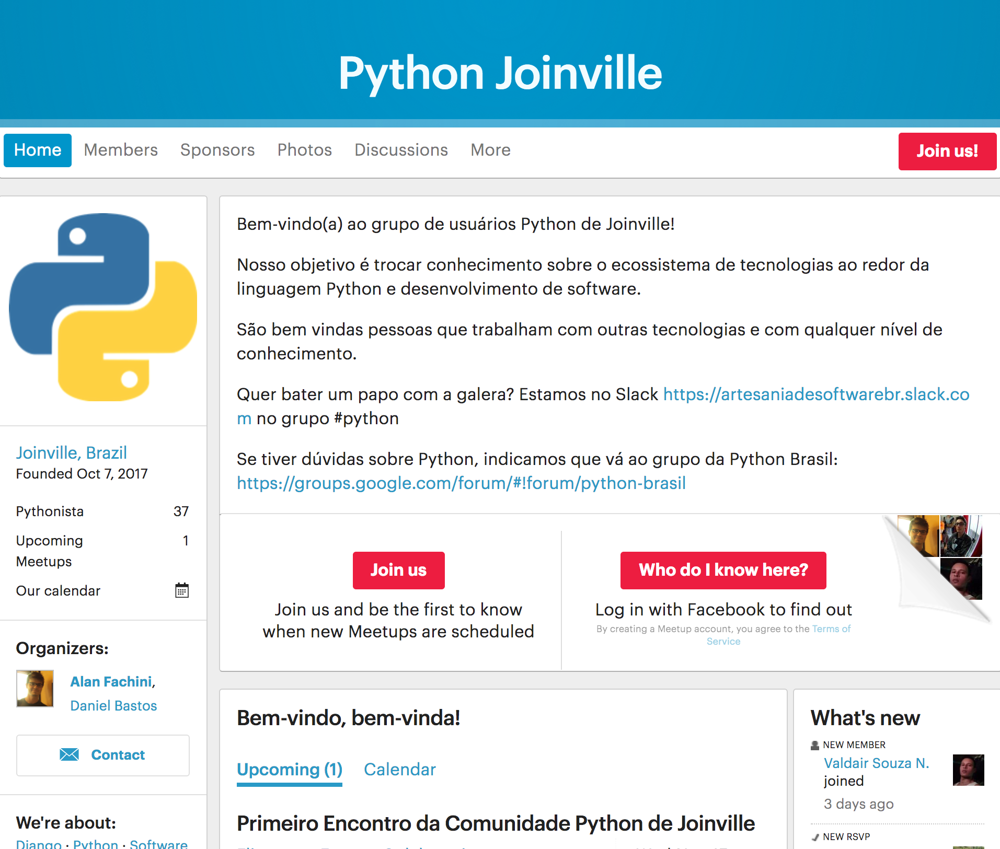
  <!-- .element: style="width: 70%" -->
   
  [meetup.com/pt-BR/Python-Joinville](https://www.meetup.com/pt-BR/Python-Joinville)

---

### Outras **comunidades**

* [Artesania de Software](https://www.meetup.com/pt-BR/Comunidade-de-Artesania-de-Software-de-Joinville/)
* [Docker Joinville](https://www.meetup.com/pt-BR/Docker-Joinville/)
* [Elixir Joinville](https://www.meetup.com/pt-BR/Elixir-Joinville/)
* [Front-end Meetup Group Joinville](https://www.meetup.com/pt-BR/femug-jlle/)
* [IoT Joinville](https://www.meetup.com/pt-BR/Meetup-de-Analise-Desenvolvimento-de-IoT-Seguranca-Joinville/)
* [JavaScript Joinville](https://www.meetup.com/pt-BR/Javascript-Joinville/)
* [Joinville Blockchain](https://www.meetup.com/pt-BR/Joinville-Blockchain-Meetup/)

Não existe uma sobre o assunto que te interessa? Funde ela!

---

### **Gestão** de projetos

Use uma metodologia para gerir seus projetos e se planejar.
Geting Things Done (**GTD**)

---

### Matriz de **decisão** de Eisenhower

  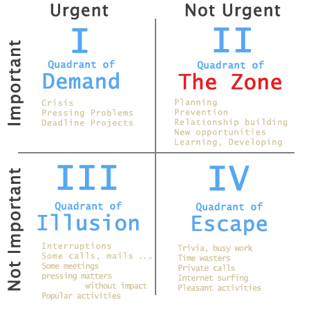
  <!-- .element: style="width: 55%" -->

---

### Frameworks de **aprendizagem**

---

  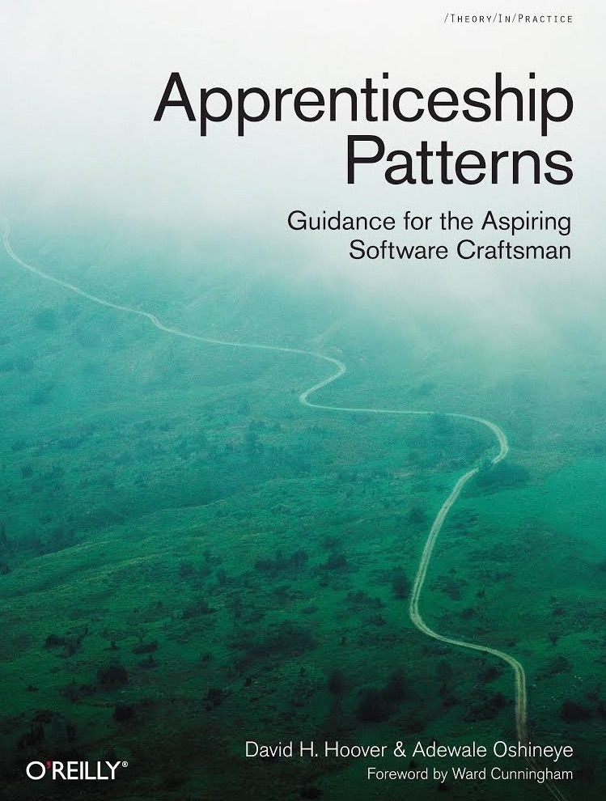
  <!-- .element: style="width: 45%" -->
   
  [chimera.labs.oreilly.com/books/1234000001813](http://chimera.labs.oreilly.com/books/1234000001813/index.html)

---

### The **NOPS** Trick

* **Notice It**: tenha consciência do problema
* **Own It**: não vou negar e ficar desconfortável, eu estou na minha zona de desconforto
* **Push Into It**: escreva quantos programas com recursão forem necessários para você dominar isso. Vá lá e converse com pessoas para ver como você se sente. Aumente o desconforto
* **Stay With It**: a ansiedade diminui, e no final das contas vem aquele momentos “É isso!” e as coisas ficam mais fáceis e claras

Note: Muito melhor do que ficar com medo e ansiedade. Enfrente esses desconfortos.

---

### **DiSSS**

* **Deconstruction**: what are the minimum learning units I should be starting with?
* **Selection**: which 20% of the blocks should I focus on for 80% more of the outcome I want?
* **Sequencing**: in what order should I learn the blocks?
* **Stakes**: how do I set up stakes to create real consequences and guarantee, follow the program?

---

### **ADEPT** Method

Use an **Analogy**, **Diagram**, **Example**, **Plain-English** description, and then a **Technical** description.

---

### **Feynman Technique**

* **Step 1**: choose the concept you want to understand
* **Step 2**: pretend you’re teaching the idea to someone else
* **Step 3**: if you get stuck, go back to the book
* **Step 4**: simplify your language

 

[Feynman Technique](http://www.farnamstreetblog.com/2012/04/learn-anything-faster-with-the-feynman-technique/)

---

  

---

## **Eventos**

Construa novas pontes!

Note: Faça amigos, crie uma rede de contactos. As pessoas confiam mais em quem elas conhecem. Faça isso de forma natural se envolvendo nas coisas.

---

## **Blogs**

* Crie um blog
* E acompanhe o blog dos outros

---

## Newsletters

Saiba o que está acntecendo no mundo.

* [AI Weekly](http://aiweekly.co)
* [Deep Learning Weekly](http://digest.deeplearningweekly.com)
* [Hacker News Newsletter](http://www.hackernewsletter.com)
* [Machine Learning Weekly](http://mlweekly.com)
* [Python Weekly](https://www.pythonweekly.com)
* [Product Hunt Daily](https://www.producthunt.com/newsletter)
* [Ruby Weekly](https://rubyweekly.com)
* [Software Lead Weekly](http://softwareleadweekly.com)

---

## **Histórias**

---

<!-- .slide: data-background="#ffffff" -->

<!-- .element: style=" margin: 0; width: 400px" -->

 
www.magrathealabs.com
 
contact@magrathealabs.com
 
+55 47 99155-2269
 

---

## **REFERÊNCIAS**
