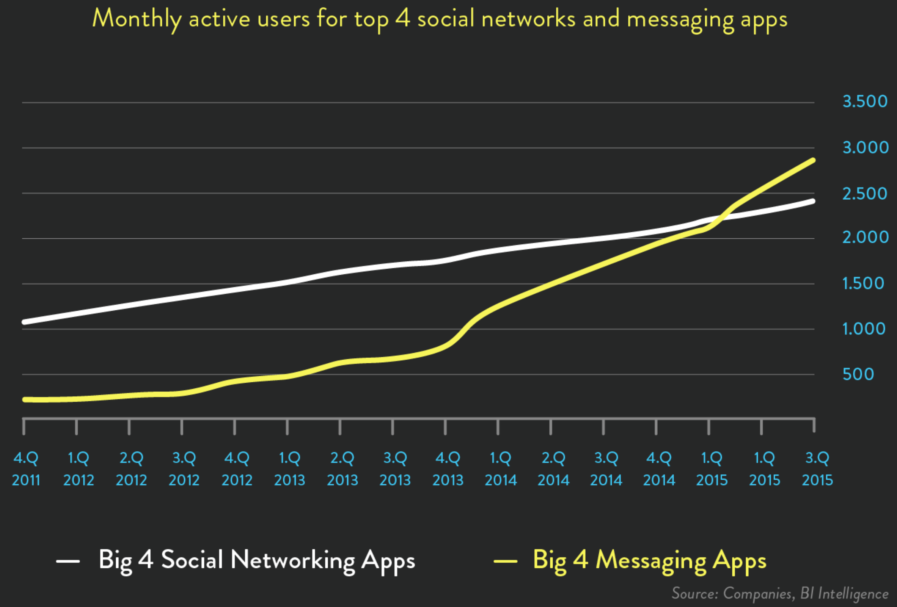
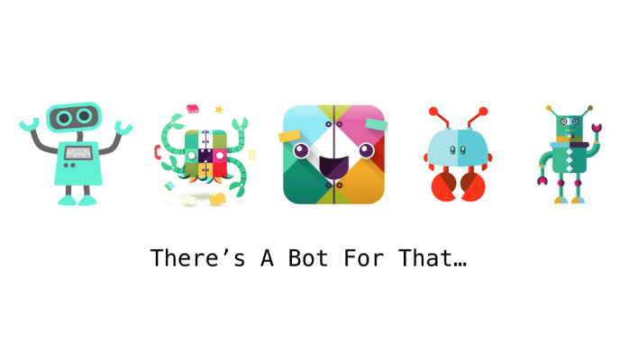
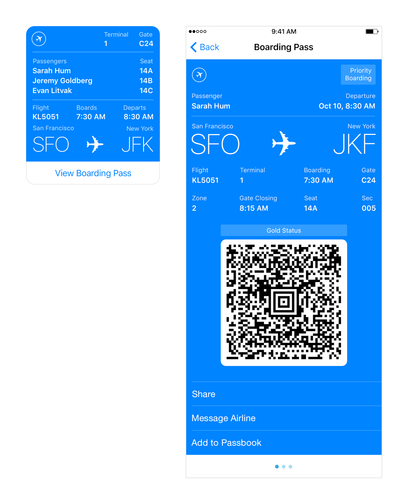

<!-- .slide: data-background-image="images/background.jpg" data-background-size="cover"; style="height: 100%" -->

### O Guia do Mochileiro dos **ChatBots**
<!-- .element: class="cover-title" -->

<div class="cover-bottom-logo">
  
  <p>www.magrathealabs.com</p>
</div>

Note: Vamos apresentar uma perspectiva de mercado, explicar os motivos pelo hype trending, o que é legal e o que não é, uma introdução técnica, guia de por onde caminhar e um demo de uma aplicação.

---

<!-- .slide: data-background-color="#212222" -->

## **trending**



Note: Messenger e WhatsApp 1.2 BI cada. Skype 300 Mi. Telegram 100 Mi. WeChat 889 Mi.

---

<!-- .slide: data-background-image="images/history/claude-shannon-john-mccarthy-ed-fredkin-joseph-weizenbaum.jpg" data-background-size="cover" -->

Note: Vocês reconhecem que estão na foto? Claude Shannon, John McCarthy, Ed Fredkin e Joseph Wizenbaum

---

## **HISTÓRIA**

<center>


<br>
1966 - ELIZA (von Joseph Weizenbaum)
</center>

Note: Primeiro ChatBot

---

## **HISTÓRIA**

* Turing Test (1950)
* Eliza (1966)
* Parry (1972)
* Jabberwacky (1988)
* A.L.I.C.E. (1995) (AIML)
* Slack Bots (2014)
* Telegram e FB Bots (2015)

Note: Eliza - respondia com matching de scripts a partir da entrada de dados pelo usuário. Na épica foi capaz de passar no teste de Turing.

Parry - Simulava uma pessoa com esquizofrenia. Era mais avançado do que a Eliza, sendo descrito como "Eliza com atitude".

Jabberwacky - Uma das primeiras tentativas de usar IA em interações humanas, como forma de entretenimento.

ALICE - Artificial Linguistic Internet Computer Entity, era um bot com capacidades de NLP. Era capaz de aplicar heuristicas para inputs humanos e realizar conversas. Vamos mostrar um exemplo similar a esse em seguida.

Watson, Siri, Google Now, Cortana.

---

## **AIML**

```xml
<category>
    <pattern>WHAT ARE YOU</pattern>
    <template>
        <think><set name="topic">Me</set></think>
        I am the latest result in artificial intelligence,
        which can reproduce the capabilities of the human brain
        with greater speed and accuracy.
    </template>
</category>
```

<center>
[alicebot.org/aiml.html](http://www.alicebot.org/aiml.html)
</center>

Note: AIML é usado até hoje em diversas aplicações, especialmente jogos

Mais de 40 mil categorias, diversos assuntos. Interpretadores em diversas linguagens

---

## **PLATAFORMAS**

* “Messaging Apps are the new Browsers” <br>
* “Chatbots are the new Apps”

---

<!-- .slide: data-background-color="#fff" -->


---

## **PLATAFORMAS DE BOTS**

---

<!-- .slide: data-background-color="#fff" -->

<center>

<!-- .element: style="width: 90%" -->
</center>

---

<!-- .slide: data-background-color="#fff" -->

## **CASOS DE USO**

<center>

</center>

Note: Existem bots para quase tudo. Eles são úteis? Vocês usam algum desses?

---

## **EXEMPLOS**

* Atendimento ao Cliente (SAC)
* Base de conhecimento de Perguntas e Respostas (FAQ)
* Assistentes Pessoais
* Alerta de mudança de status
* IoT

Note: Imagine um bot onde você coloca o id de tracking dos correios e ele te avisa quando o status mudou.

FAQ and support questions usually follow a pattern → repeated questions

Much more cost effective than humans

---

<center>

<!-- .element: style="width: 80%" -->

[github.com/fablabjoinville/jarbas](https://github.com/fablabjoinville/jarbas)
</center>

---

<center>

<!-- .element: style="width: 60%" -->

[github.com/fablabjoinville/groselha](https://github.com/fablabjoinville/groselha)
</center>

---

<!-- .slide: data-background-color="#fff" -->

<center>

<!-- .element: style="width: 90%" -->

[github.com/mlabs-marvin](https://github.com/mlabs-marvin)
</center>

---

<center>

<!-- .element: style="width: 50%" -->
</center>

---

<center>

<!-- .element: style="width: 35%" -->
</center>

---

<!-- .slide: data-background-color="#E2E6EA" -->

<center>

<!-- .element: style="width: 90%" -->
</center>

---

## **O QUE É DIFÍCIL?**

ChatBots simples são fáceis de fazer, mas ...

* ChatBots inteligentes exigem conhecimento em ML
* UX para ChatBots é muito mais difícil que para GUIs

---

### **CONSTRUINDO UM CHATBOT**

---

## **wit.ai**

* Extração de Intenções e Entidades
* Entidades padrões: temperatura, números, URLs, emails, etc.
* Aprendizado de Máquina fácil
* Integra por padrão ao Messenger

Note: Adquirido pelo Facebook

<center>
[wit.ai](https://wit.ai)
</center>

---

<!-- .slide: data-background-color="#fff" -->

<center>

<!-- .element: style="width: 80%" -->
</center>

---

## **wit.ai**

```
{
  "outcomes": [{
    "_text": "how many people between Tuesday and Friday",
    "intent": "query_metrics",
    "entities": {
      "datetime": [{
        "value": {
          "from": "2014-07-01T00:00:00.000-07:00",
          "to": "2014-07-02T00:00:00.000-07:00"
        }
      }]
    },
    "confidence": 0.621
  }]
}
```

---

## **THE HACKER WAY**

* Flask (Python)
* RiveScript
* Redis
* Heroku

<br>

<center>
[github.com/magrathealabs/marvin-bot](https://github.com/magrathealabs/marvin-bot)
</center>

---

## **ARQUITETURA**

---

<!-- .slide: data-background-color="#fff" data-background-image="images/architecture.png" data-background-size="70%" -->

---

## **Flask (Python)**

```
@app.route('/', methods=['POST'])
def handle_messages():
  message_entries = json.loads(request.data)['entry']

  for entry in message_entries:
    for message in entry['messaging']:
      sender_id = message['sender']['id']

      if message.get('message'):
        text = message['message']['text']
        reply = bot.reply(sender_id, text)
        client.send(sender_id, TextMessage(reply))
    return 'OK'
```

<center>
[github.com/magrathealabs/marvin-bot/blob/master/app.py](https://github.com/magrathealabs/marvin-bot/blob/master/app.py)
<!-- .element: style="font-size: 30px" -->
</center>

---

### **RiveScript**

Linguagem de script para chatbots com libs para Python, Java, Go, JavaScript ...

Try it: [rivescript.com/try](https://www.rivescript.com/try) <br>
Tutorial: [rivescript.com/docs/tutorial](https://www.rivescript.com/docs/tutorial)

Note: Você pode subir o REPL (interpretador) e ir testando seus scripts

---

### **RiveScript**

```
self.bot = RiveScript(
  utf8=True,
  session_manager=RedisSessionStorage()
)
self.bot.load_directory(directory)
self.bot.sort_replies()
```

<center>
[github.com/magrathealabs/marvin-bot/tree/master/bot](https://github.com/magrathealabs/marvin-bot/tree/master/bot)
<!-- .element: style="font-size: 30px" -->
</center>

---

### **RiveScript**

```
+ (qual o seu nome|qual é o seu nome|quem é você|quem é)
- Eu sou <bot name>.
- Você pode me chamar de <bot name>.

+ (meu|o meu) nome é *
- <set name={formal}<star2>{/formal}>Olá, <get name>.
- <set name={formal}<star2>{/formal}><get name>, olá!

> object add python
    a, b = args
    return int(a) + int(b)
< object

+ quanto é # mais #
- <star1> + <star2> = <call>add <star1> <star2></call>
```

<center>
[github.com/magrathealabs/marvin-bot/tree/master/conversations/marvin](https://github.com/magrathealabs/marvin-bot/tree/master/conversations/marvin)
<!-- .element: style="font-size: 30px" -->
</center>

---

<!-- .slide: data-background-image="images/demo.jpeg" data-background-size="cover"; -->

---

<center>

<!-- .element: style="width: 800px" -->

<br>
[m.me/magrathealabs](https://www.messenger.com/t/magrathealabs)
</center>

---

## **RESUMINDO**

* Chatbots estão passando pela curva do hype
* São uma realidade e a inovação está acontecendo agora
* Vão mudar a forma como interagimos com serviços
* A engenharia é fácil
* Bots mais avançados são difíceis (NLU, AI)
* UX é a parte mais difícil

<br>

<center>
`EXPERIMENTE!`
</center>

---

## **REFERÊNCIAS**

* Pais da IA: https://www.dunebook.com/will-artificial-intelligence-ai-ever-rule-world/
* Imagem Usuários de Plataformas: https://speakerdeck.com/christophrumpel/nela-and-the-chatbots
* AIML: http://www.alicebot.org/aiml.html
* Imagem Plataforma: OReilly
* Exemplos Rayban e Flight: https://dribbble.com/users/347241/
