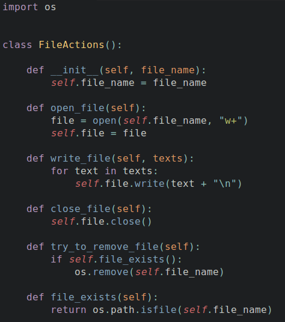
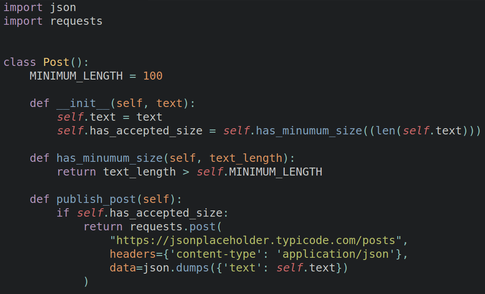
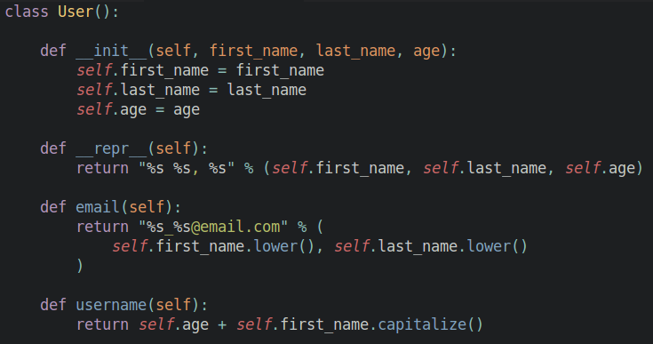

<!-- .slide: data-background-image="images/background.jpg" data-background-size="cover"; style="height: 100%" -->


## &nbsp; Testes de Aplicação em Python
<!-- .element: class="cover-title" -->

<div class="cover-bottom-logo">
  
  <p>www.magrathealabs.com</p>
</div>

---

### **O BÁSICO**

<center>**Unittest:** módulo já presente na biblioteca padrão do Python.</center>

```py
import unittest

def fun(x):
    return x + 1

class MyTest(unittest.TestCase):
    def test(self):
        self.assertEqual(fun(3), 4)


if __name__ == '__main__':
    unittest.main()

```

```py
$ python test_with_unittest.py
```

Note:

The standard workflow is:
1. You define your own class derived from unittest.TestCase.
2. Then you fill it with functions that start with ‘test_’.
3. You run the tests by placing unittest.main() in your file, usually at the bottom.


---

### **FERRAMENTAS**

<center>**Pytest:** contém várias features e um sintaxe extremamente simples.</center>

```py
def func(x):
    return x + 1

def test_answer():
    assert func(3) == 5
```

```sh
$ py.test
```

<center style="font-size: 32px">
Descoberta de testes | Mensagens de erros "aconselháveis" Compartilhamento de fixtures
</center>

<center style="font-size: 25px">https://github.com/jiffyclub/pytest-features</center>

---

### **TIPOS DE TESTES**

- **Testes unitários**
- Testes de integração
- Testes funcionais


Note:

-- automated tests -- <br>
1) Testes unitários: testa pedaços pequenos de código, tipicalmente funções individuais isoladas e sozinhas. <br> <br>
2) Testes de integração: testa como as partes do sistema funcionam juntas. Não são isolados de outros componentes e.g. banco de dados <br> <br>
3) Testes funcionais: This is a verification activity; did we build a correctly working product? Does the software meet the business requirements?
Test cases that cover all the possible scenarios we can think of, even if that scenario is unlikely to exist "in the real world".


---

### **DIFERENTES ABORDAGENS**

- "Classical"
- "Mockist"


Note:
1) Classical: dá preferência a objetos reais e dublês (se for ruim utilizar o implementação real). State verification. Don’t couple tests to implementation <br>
2) Mockist: dá preferência sempre a mocks para qualquer objeto. Behaviour verification.

---

 > ## **Mockist**

---

### **DUBLÊS DE TESTE**

<center>


<ul style="font-size: 30px">
    <li>SUT (System under test)</li>
    <li>DOC (Dependent-on component)</li>
</ul>

</center>

Note:
SUT = Short for whatever thing we are testing<br><br>
DOC = Individual class or a large-grained component on which the system under test (SUT) depends. The dependency is usually one of delegation via method calls.

---

### **Definição**
<center>Termo genérico para qualquer caso em que um objeto de produção é substituído com fins de testar a aplicação.</center>

### **Tipos**
<ol>
    <li>*Dummy*</li>
    <li>*Stub*</li>
    <li>*Fake*</li>
    <li>*Spy*</li>
    <li>*Mock*</li>
</ol>


---


<h3>Dummy</h3>
<center></center>

Note:
Dummy: objects are passed around but never actually used. Usually they are just used to fill parameter lists

---

<h3>Stub</h3>
<center></center>

Note:
Stubs: provide canned answers to calls made during the test, usually not responding at all to anything outside what's programmed in for the test.

----


<center></center>

---

<h3>Fake</h3>
<center></center>

Note:
Fake: objects actually have working implementations, but usually take some shortcut which makes them not suitable for production (an in memory database is a good example).

----

<center>


</center>

---

<h3>Spy</h3>
<center></center>

Note:
Spies: are stubs that also record some information based on how they were called. One form of this might be an email service that records how many messages it was sent.

----

<center></center>

---

<h3>Mock</h3>
<center></center>

Note:
Mocks: are what we are talking about here: objects pre-programmed with expectations which form a specification of the calls they are expected to receive.<br><br>

----

<center></center>
---

<h3>Mocks vs. Stubs</h3>
<p><center style="font-size: 23px">https://martinfowler.com/articles/mocksArentStubs.html</center></p>

<p>
<center>A grande diferença reside na maneira em que os resultados dos testes são verificados.<br>
- Verificação de comportamento vs. verificação de estado
</center></p>

---

<h3>Libs</h3>

<ol>
    <li>Mock</li>
    <ul>
        <li>https://github.com/testing-cabal/mock</li>
        <li>https://github.com/getsentry/responses</li>
        <li>https://github.com/openstack/requests-mock</li>
    </ul>
    <li>Mocks e stubs</li>
    <ul>
        <li>https://github.com/uber/doubles</li>
    </ul>
</ol>

---

<h3>`unittest.mock`</h3>

<center>
Substitui funções, classes e objetos com `mock objects` para que seja possível fazer asserções sobre como foram utilizados.
</center>

----

<center>
Como testar ações num arquivo?

</center>

Note:
https://docs.python.org/3/library/unittest.mock.html#unittest.mock.Mock.assert_called

---

<h3>`requests_mock`</h3>

<center>
Mocks de respostas para a biblioteca `requests`.
</center>

----

<center>
Como testar chamadas de API?

</center>

---

<h3>`doubles`</h3>

<center>
Fornece funcionalidade para "`stubbing`" e "`mocking`" com sintaxe simples e expressiva.
</center>

----

<center>
Como testar ações num arquivo?

</center>

---

> ## **Classicist**

----

<center>
Como testar ações num arquivo?

</center>

----

<center>
Como testar uma classe de usuário?

</center>

---

### **Quando ser um "Classicist" ou "Mockist"?**

- Objetos colaboradores são simples? Classicist
- Interação entre objetos é difícil e incómodo de reproduzir? Mockist

---

<h3>Referências:</h3>

<ul style="font-size: 25px">
    <li>http://xunitpatterns.com/</li>
    <li>http://www.softwaretestinghelp.com/guide-to-functional-testing/</li>
    <li>https://codeutopia.net/blog/2015/03/01/unit-testing-tdd-and-bdd/</li>
    <li>https://codeutopia.net/blog/2015/04/11/what-are-unit-testing-integration-testing-and-functional-testing/</li>
    <li>https://dev.to/mistermocha/python-unit-testing-with-mock---part-one</li>
    <li>https://blog.pragmatists.com/test-doubles-fakes-mocks-and-stubs-1a7491dfa3da</li>
    <li>https://klauslaube.com.br/2015/06/29/os-testes-e-os-dubles-parte-2.html</li>
</ul>
