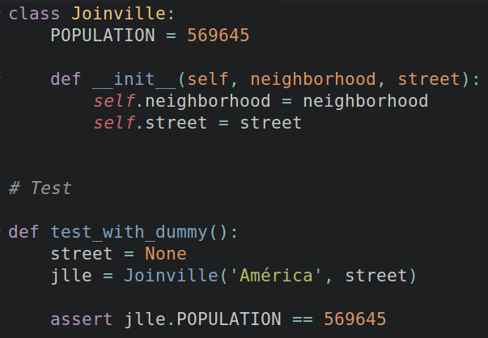
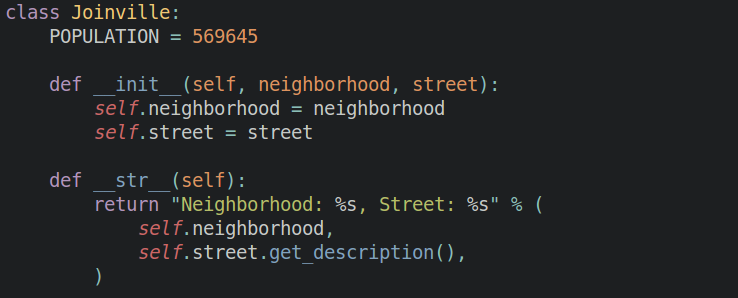
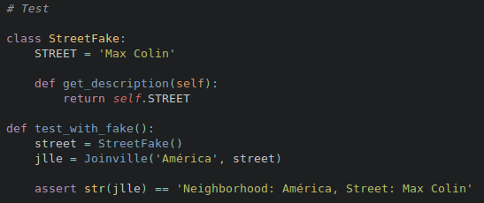
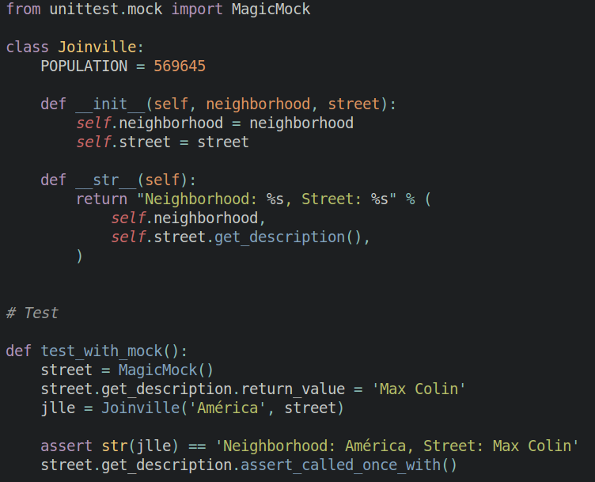
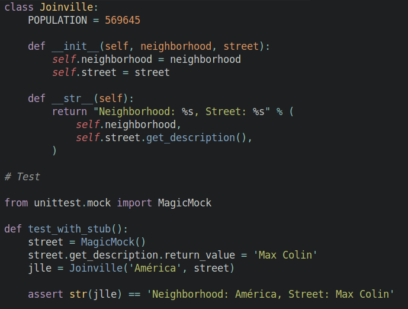
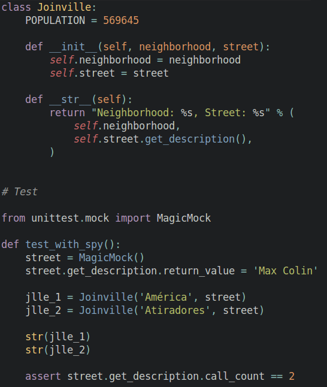

<!-- .slide: data-background-image="images/background.jpg" data-background-size="cover"; style="height: 100%" -->


## &nbsp; Testes de Aplicação em Python
<!-- .element: class="cover-title" -->

<div class="cover-bottom-logo">
  
  <p>www.magrathealabs.com</p>
</div>

---

### **O BÁSICO**

<center>**Unittest:** Modulo já presente na biblioteca padrão do Python.</center>

```py
import unittest

def fun(x):
    return x + 1

class MyTest(unittest.TestCase):
    def test(self):
        self.assertEqual(fun(3), 4)


if __name__ == '__main__':
    unittest.main()

```

```py
$ python test_with_unittest.py
```

---

<center>**Doctest:** Pesquisa por pedaços de texto que se assemelham às sessões interativas de Python em "docstrings".</center>

```py
def square(x):
    """Return the square of x.

    >>> square(2)
    4
    >>> square(-2)
    4
    """

    return x * x

if __name__ == '__main__':
    import doctest
    doctest.testmod()
```

```py
$ python test_with_doctest.py
```

---

### **FERRAMENTAS**

<center>**Pytest:** Contém várias features e um sintaxe extremamente simples.</center>

```py
def func(x):
    return x + 1

def test_answer():
    assert func(3) == 5
```

```sh
$ py.test
```

---

<center>**Tox:** Automatiza e gerencia ambientes de teste contra múltiplas configurações.</center>


```sh
$ tox
```


---

### **DUBLÊS DE TESTE**

<center>


<ul style="font-size: 30px">
	<li>SUT (System under test)</li>
	<li>DOC (Dependent-on component)</li>
</ul>

</center>

---

### **Definição**
<center>
	Termo genérico para qualquer caso em que um objeto de produção é substituído com fins de testar a aplicação.
</center>

### **Tipos**
<ol>
	<li>*Dummy*</li>
	<li>*Fake*</li>
	<li>*Mock*</li>
	<li>*Stub*</li>
	<li>*Spy*</li>
</ol>

Note:
 Dummy: objeto que é passado para o sistema como um argumento (ou um atributo de um argumento), mas nunca é realmente usado, ou seja, somente preenche passagens de parâmetros.
 Stub: objeto que substitui outro com um objeto de teste-especifico que alimento com inputs o SUT, o sistema que está sendo testado
 Spy: objeto que captura os chamadas de outputs feitos para o componente dependente pelo sistema sendo testado para uma verificação posterior.
 Mock: objeto utilizado para substituir o componente real que o sistema sendo testado depende para que a verificação que os outputs estão sendo utilizados da maneira certa pelo sistema seja feita.
 Fake: objeto que substitui a funcionalidade do componente dependente com uma implementação alternativa da mesma funcionalidade.

---

<center>

<h3>Dummy</h3>
Usado apenas para preencher passagens de parâmetros


</center>

---

<h3>Fake</h3>

<center>
<ul style="font-size: 30px">
    <li>Objeto com certa funcionalidade</li>
    <li>Útil para resolver alguma dependência em testes</li>
</ul>


</center>

----

<center>




</center>


---

<h3>Mock</h3>

<center>
<ul style="font-size: 30px">
    <li>Setar retornos de valores pré-definidos</li>
    <li>Verificar se algum método foi chamado durante a execução do teste</li>
</ul>


</center>

----

<center>

</center>

---

<h3>Stub</h3>

<center>

<ul style="font-size: 30px">
    <li>Setar retornos de valores pré-definidos</li>
    <li>Não verifica se algum método foi chamado durante a execução do teste</li>
</ul>


</center>

----

<center>

</center>

---

<h3>Spy</h3>

<center>

<ul style="font-size: 30px">
    <li>Não setamps retornos de valores pré-definidos</li>
    <li>Armazenamos as chamadas realizadas por colaboradores</li>
</ul>


</center>

----

<center>

</center>

---

<h3>Mocks vs. Stubs</h3>

> Ainda, ocasionalmente, me confundo entre os dois.

<p>
    <center style="font-size: 23px">https://martinfowler.com/articles/mocksArentStubs.html</center>
</p>


<center>
A grande diferença reside na maneira em que os resultados dos testes são verificados.
<br>
- Verificação de estado vs. verificação de comportamento
</center>

---


Referências:

- http://xunitpatterns.com/
<br>
- https://klauslaube.com.br/2015/06/29/os-testes-e-os-dubles-parte-2.html
